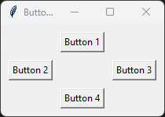

# Button Layout GUI

This Python program creates a graphical user interface (GUI) with four buttons.

## Dependencies

This program requires the following dependencies to be installed:

- Python 3.x
- tkinter

You can install the dependencies using the following command:

```shell
pip install tk
```

## Usage

To run the program, execute the following code:

```shell
python button_layout.py
```

Replace `button_layout.py` with the actual name of the Python script file.

## Program Flow

1. The program imports the necessary module `tkinter` for creating the GUI.

2. The program defines a function `button_click()` to handle button clicks. In this example, the function simply prints a message indicating which button was clicked.

3. The program defines a function `create_gui()` to create and display the GUI.

4. Inside the `create_gui()` function, the main window is created using `tk.Tk()`.

5. The title of the main window is set to "Button Layout" using `root.title()`.

6. Four buttons are created using `tk.Button()`, each with a unique text and associated command. The command is set to call the `button_click()` function with the corresponding button number.

7. The buttons are placed in a grid layout using `button.grid()` with appropriate row and column values. The `pady` and `padx` parameters are used to add padding around the buttons.

8. The GUI event loop is started using `root.mainloop()`, which continuously handles user interactions with the GUI.

9. The program runs indefinitely until the GUI window is closed.

## Example

Here's an example of running the program:

```shell
python3 button_layout.py
```

## Output




The GUI window will appear with four buttons labeled "Button 1", "Button 2", "Button 3", and "Button 4". Clicking any of the buttons will print a message indicating the button number.