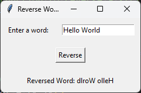

# Reverse Word GUI

This Python program creates a graphical user interface (GUI) that asks the user to enter a word and displays its reverse.

## Dependencies

This program requires the following dependencies to be installed:

- Python 3.x
- tkinter

You can install the dependencies using the following command:

```shell
pip install tk
```

## Usage

To run the program, execute the following code:

```shell
python reverse_word.py
```

Replace `reverse_word.py` with the actual name of the Python script file.

## Program Flow

1. The program imports the necessary module `tkinter` for creating the GUI.

2. The program defines a function `reverse_string()` to reverse the input word and display the result.

3. Inside the `reverse_string()` function, the input word is obtained from the `entry` widget using `entry.get()`.

4. The input word is reversed using slicing notation `[::-1]` and stored in the `reversed_word` variable.

5. The text of the `result_label` widget is updated to display the reversed word using `result_label.config()`.

6. The program creates the main window using `tk.Tk()`.

7. The title of the main window is set to "Reverse Word" using `root.title()`.

8. Widgets are created and placed in a grid layout using `tk.Label()`, `tk.Entry()`, and `tk.Button()`. The `row` and `column` parameters determine the position of each widget in the grid. The `sticky` parameter is set to "w" to left-align the label. The `padx` and `pady` parameters are used to add padding around the widgets.

9. The command of the `reverse_button` is set to call the `reverse_string()` function when clicked.

10. The `result_label` widget is initially empty and will be updated with the reversed word.

11. The GUI event loop is started using `root.mainloop()`, which continuously handles user interactions with the GUI.

12. The program runs indefinitely until the GUI window is closed.

## Example

Here's an example of running the program:

```shell
python3 reverse_word.py
```

## Output



The GUI window will appear with a label asking the user to enter a word, an entry field to input the word, and a "Reverse" button. After entering a word and clicking the button, the reversed word will be displayed below.