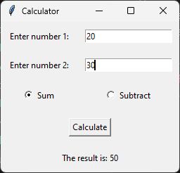

# Calculator GUI

This Python program creates a graphical user interface (GUI) that asks the user to enter two integers and performs addition or subtraction based on the selected operation.

## Dependencies

This program requires the following dependencies to be installed:

- Python 3.x
- tkinter

You can install the dependencies using the following command:

```shell
pip install tk
```

## Usage

To run the program, execute the following code:

```shell
python calculator.py
```

Replace `calculator.py` with the actual name of the Python script file.

## Program Flow

1. The program imports the necessary module `tkinter` for creating the GUI.

2. The program defines a function `calculate_result()` to perform the addition or subtraction based on the selected operation and display the result.

3. Inside the `calculate_result()` function, the two input numbers are obtained from the `entry_num1` and `entry_num2` widgets using `entry_num1.get()` and `entry_num2.get()`. They are converted to integers using `int()`.

4. The selected operation is obtained from the `operation_var` variable using `operation_var.get()`. If the operation is "Sum", the numbers are added; otherwise, they are subtracted.

5. The result is stored in the `result` variable.

6. The text of the `result_label` widget is updated to display the result using `result_label.config()`.

7. The program creates the main window using `tk.Tk()`.

8. The title of the main window is set to "Calculator" using `root.title()`.

9. Widgets are created and placed in a grid layout using `tk.Label()`, `tk.Entry()`, `tk.Radiobutton()`, and `tk.Button()`. The `row` and `column` parameters determine the position of each widget in the grid. The `sticky` parameter is set to "w" to left-align the labels. The `padx` and `pady` parameters are used to add padding around the widgets.

10. The `operation_var` is created as a `tk.StringVar()` and set to "Sum" initially.

11. Two radio buttons (`radio_sum` and `radio_subtract`) are associated with the `operation_var` using the `variable` and `value` parameters. The text of the radio buttons indicates the corresponding operation.

12. The `calculate_button` is created with text "Calculate" and associated with the `calculate_result()` function using the `command` parameter.

13. The `result_label` is initially empty and will be updated with the calculated result.

14. The GUI event loop is started using `root.mainloop()`, which continuously handles user interactions with the GUI.

15. The program runs indefinitely until the GUI window is closed.

## Example

Here's an example of running the program:

```shell
python3 calculator.py
```

## Output



The GUI window will appear with two input fields for numbers, two radio buttons for operations ("Sum" and "Subtract"), and a "Calculate" button. After entering two numbers and selecting an operation, clicking the "Calculate" button will display the result below.