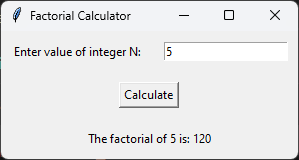

# Factorial Calculator GUI

This Python program creates a graphical user interface (GUI) that asks the user to enter an integer N and calculates its factorial.

## Dependencies

This program requires the following dependencies to be installed:

- Python 3.x
- tkinter

You can install the dependencies using the following command:

```shell
pip install tk
```

## Usage

To run the program, execute the following code:

```shell
python factorial_calculator.py
```

Replace `factorial_calculator.py` with the actual name of the Python script file.

## Program Flow

1. The program imports the necessary modules `tkinter` and `math` for creating the GUI and calculating the factorial.

2. The program defines a function `calculate_factorial()` to calculate the factorial of the entered integer and display the result.

3. Inside the `calculate_factorial()` function, the input integer `N` is obtained from the `entry` widget using `entry.get()`. It is converted to an integer using `int()`.

4. The program checks if the entered integer is negative. If it is negative, the `result_label` is updated to display that the factorial is undefined for negative numbers.

5. If the entered integer is non-negative, the factorial is calculated using `math.factorial()` and stored in the `result` variable.

6. The text of the `result_label` widget is updated to display the calculated factorial using `result_label.config()`.

7. The program creates the main window using `tk.Tk()`.

8. The title of the main window is set to "Factorial Calculator" using `root.title()`.

9. Widgets are created and placed in a grid layout using `tk.Label()`, `tk.Entry()`, and `tk.Button()`. The `row` and `column` parameters determine the position of each widget in the grid. The `padx` and `pady` parameters are used to add padding around the widgets.

10. The `calculate_button` is created with text "Calculate" and associated with the `calculate_factorial()` function using the `command` parameter.

11. The `result_label` is initially empty and will be updated with the calculated factorial or an error message.

12. The GUI event loop is started using `root.mainloop()`, which continuously handles user interactions with the GUI.

13. The program runs indefinitely until the GUI window is closed.

## Example

Here's an example of running the program:

```shell
python3 factorial_calculator.py
```

## Output



The GUI window will appear with a label asking the user to enter the value of integer N, an entry field to input the value, and a "Calculate" button. After entering the value and clicking the button, the factorial of the entered integer will be displayed below.